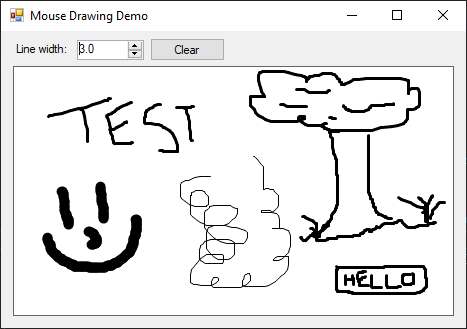
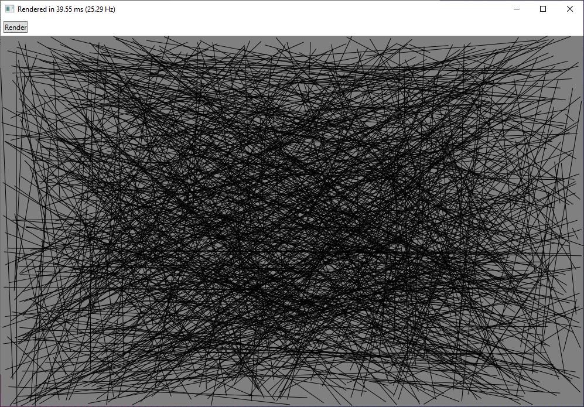
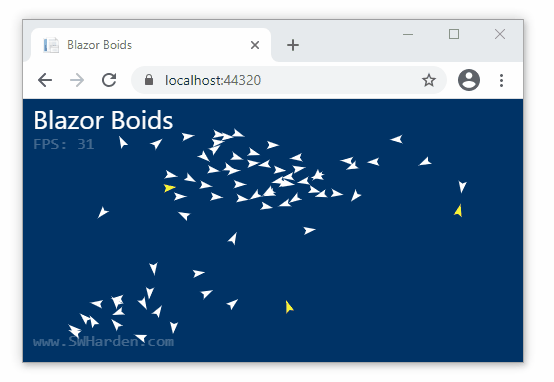

# C# Data Visualization

**This repository is a collection of minimal-case code examples that display data with C#.** Simple examples use the System.Drawing library to draw on the screen, but alternative rendering systems like WPF and SkiaSharp with OpenGL are also explored. Additional resources can be found on the [C# Data Visualization Website](https://swharden.com/CsharpDataVis/).

[Mystify](#advanced-examples) | [Life](#advanced-examples) | [Boids](#advanced-examples)
---|---|---
||

### Drawing with C#

Description | Screenshot
---|---
**[Drawing Lines](examples/2019-06-01-graphics-basics/readme.md)** - This project demonstrates a simple way to draw lines in a Windows Form. Here we create a Bitmap then use a Graphics object to draw lines on it. The Bitmap is then assigned to PictureBox.Image and displayed to the user. | 
**[Drawing with the Mouse](examples/2019-06-02-drawing-with-mouse/readme.md)** - This project uses a PictureBox's MouseMove event handler to create a MSPaint-like drawing surface with only a few lines of code. | 
**[Plotting on a 2D Coordinate System](/examples/2019-06-03-coordinate-system/readme.md)** - A simple but challenging task when plotting data on a bitmap is the conversion between 2D data space and bitmap pixel coordinates. If your axis limits are -10 and +10 (horizontally and vertically), what pixel position on the bitmap corresponds to (-1.23, 3.21)? This example demonstrates a minimal-case unit-to-pixel method and uses it to plot X/Y data on a bitmap. | 

### Bitmap Pixel Manipulation

Description | Screenshot
---|---
**[Modifying Bitmap Data in Memory](/examples/2019-06-04-pixel-setting/readme.md)** - Bitmaps in memory have a certain number of bytes per pixel, so they're easy to convert to/from byte arrays. This example shows how to convert a Bitmap to a byte array, fill the array with random values, and convert it back to a Bitmap to display in a PictureBox. This method can be faster than using drawing methods like GetPixel and PutPixel. | 
**[Setting Pixel Intensity from a Value](/examples/2019-06-05-grayscale-image/readme.md)** - This example shows how to create an 8-bit grayscale image where pixel intensities are calculated from a formula (but could easily be assigned from a data array). This example also demonstrates the important difference between Bitmap _width_ and _span_ when working with byte positions in memory. | 

### Drawing in WPF Applications

Description | Screenshot
---|---
**[Drawing Lines with WPF](examples/2019-10-09-WPF-Draw-Lines)** is a minimal-case example to demonstrate how to add primitive shapes to a canvas in a WPF application | 

### Hardware-Accelerated Drawing with SkiaSharp and OpenGL

**System.Drawing uses the GDI+ backend to draw on the screen.** It is convenient because it is been around forever and is easily supported by .NET, but it does not perform well in parallel environments or with large bitmaps (e.g., full screen). See [this page](https://photosauce.net/blog/post/5-reasons-you-should-stop-using-systemdrawing-from-aspnet) for a thorough description of its limitations. Most examples on this page use GDI+ to create images. For a long time System.Drawing was limited to .NET Framework applications, but in 2018 the System.Drawing.Common package brought System.Drawing support to .NET Core.

**[SkiaSharp](https://github.com/mono/SkiaSharp) is a cross-platform .NET API for drawing with Skia**, an open-source 2D drawing library developed by Google. SkiaSharp has an OpenGL control which allows hardware-accelerated rendering using OpenGL out of the box without requiring any OpenGL knowledge.

Description | Screenshot
---|---
**[Drawing with SkiaSharp and OpenGL](/examples/2019-09-08-SkiaSharp-openGL)** - This program demonstrates how to vastly outperform GDI+ (System.Drawing) when drawing thousands of semi-transparent lines at full-screen window sizes. | 

See also: **[QuickPlot](https://github.com/swharden/QuickPlot)** - an interactive .NET plotting library using SkiaSharp

### Drawing in Blazor with WebAssembly

Client-side Blazor lets graphics models written in C# compile-down to WebAssembly that can run in the browser on a static website. No special hosting is required! At the time of writing client-side Blazor is on the bleeding edge of development, and performance is mediocre. For intense rendering jobs in the browser JavaScript is still required, but for simple tasks you can define graphics models in C# and render them with a HTML Canvas API without ever learning C#

Description | Screenshot
---|---
[**Animation in the Browser with Blazor WebAssembly and HTML Canvas**](/examples/2021-01-07-blazor-html-canvas) (see [blog post](https://swharden.com/blog/2021-01-07-blazor-canvas-animated-graphics/) and [live demo](https://swharden.com/blog/2021-01-07-blazor-canvas-animated-graphics/app/)) - This program demonstrates how to write a graphics model in C# and render it using the `Blazor.Extensions.Canvas` to draw on a HTML canvas. See the [blog post](https://swharden.com/blog/2021-01-07-blazor-canvas-animated-graphics) for details | 
[**Blazor Boids in your Browser**](/examples/2021-01-08-blazor-boids) (see [blog post](https://swharden.com/blog/2021-01-08-blazor-boids/) and [live demo](https://swharden.com/blog/2021-01-08-blazor-boids/app/)) - demonstrates how to use a C# graphics model with .NET code managing business logic and a JavaScript render method which uses the high speed HTML5 canvas to do the drawing. | 
[**Mystify your Browser with Blazor**](/examples/2021-01-09-blazor-mystify) (see [blog post](https://swharden.com/blog/2021-01-09-blazor-mystify/) and [live demo](https://swharden.com/blog/2021-01-09-blazor-mystify/app)) The classic Windows 3 screensaver now runs in the browser! The graphics model is in C# and uses Blazor bindings to control various settings. Blazor tells JavaScript what to render (using JSON) and JavaScript draws colored lines on a HTML canvas. | 
[**Google Charts in Blazor**](/examples/2021-01-10-blazor-google-charts) (see [blog post](https://swharden.com/blog/2021-01-12-blazor-google-charts/) and [live demo](https://swharden.com/blog/2021-01-12-blazor-google-charts/app)) shows how to generate data in C# and display it interactively in the browser using Google Charts | 

### Audio

Description | Screenshot
---|---
**[Plotting Audio Amplitude](/examples/2019-06-06-audio-level-monitor/readme.md)** - This example uses [NAudio](https://github.com/naudio/NAudio) to access the sound card, calculates the amplitude of short recordings, then graphs them continuously in real time with [ScottPlot](https://github.com/swharden/ScottPlot). This project is a good place to get started to see how to interface audio input devices. | 
**[Plotting Audio Values](/examples/2019-06-07-audio-visualizer/readme.md)** - This example uses [NAudio](https://github.com/naudio/NAudio) to access the sound card and plots raw PCM values with [ScottPlot](https://github.com/swharden/ScottPlot). These graphs contain tens of thousands of data points, but remain fully interactive even as they are being updated in real time. | 
**[Plotting Audio FFT](/examples/2019-06-08-audio-fft)** - This example continuously plots the frequency component of an audio input device. The [NAudio](https://github.com/naudio/NAudio) library is used to acquire the audio data and process the FFT and [ScottPlot](https://github.com/swharden/ScottPlot) is used for the plotting. | 
[**Microphone Level Monitor**](/examples/2021-07-03-console-microphone/) - This console application uses NAudio to continuously monitor the microphone and display audio levels by printing characters to the screen. Examples are provided for mono and stereo audio inputs. | 

## Advanced Examples

These examples were created for the [C# Data Visualization Website](https://swharden.com/CsharpDataVis) and mostly involve creating rendering-library-agnostic _models_ of complex systems, then developing rendering systems that can display the models.

Project | Screenshot
---|---
[**Mystify Your Mind with C#**](/examples/drawing/mystify) - The classic screensaver implemented using both OpenGL and System.Drawing. See [C# Data Visualization Website](https://swharden.com/CsharpDataVis) for details.|
[**Game of Life in C#**](/examples/drawing/game-of-life) - Conway's Game of Life is a zero-player video game that uses a few basic rules to determine if cells live or die based on the density of their neighbors. In this project we create Life using C# and System.Drawing.  See [C# Data Visualization Website](https://swharden.com/CsharpDataVis) for details.|
[**Boids in C#**](/examples/drawing/boids) - This project implements the Boids flocking algorithm in C# to create an interesting procedural animation of bird-drones (boids) scurrying about the screen.  See [C# Data Visualization Website](https://swharden.com/CsharpDataVis) for details.|
[**Boids in C# with SkiaSharp**](/examples/drawing/boids2) - This project is an extension of the original boids project that uses an abstracted rendering system supporting SkiaSharp and OpenGL for hardware-accelerated rendering.  See [C# Data Visualization Website](https://swharden.com/CsharpDataVis) for details.|

## Child Projects

Some code examples started here and have matured into their own repositories...

Project | Screenshot
---|---
**[ScottPlot](https://scottplot.net)** is an interactive plotting library for .NET. If you're just looking for an easy way to interactively display some data on a graph using C#, ScottPlot might be for you! | 
**[Spectrogram](https://github.com/swharden/Spectrogram)** is a simple spectrogram library for .NET. Specrogram converts signals (typically audio) into the frequency-domain and makes it easy to display spectrograms as 2D images. Spectrogram is fast enough to display the audio spectrum in real time. | 
**[Sound Card ECG](https://github.com/swharden/SoundCardECG)** uses scottplot to interactively display the soundcard signal in real time| 
**[HHSharp](https://github.com/swharden/HHSharp)** is an interactive Hodgkin-Huxley neuron simulator|

## Older Projects

**⚠️ Code quality warning:** This section contains projects and notes I created when I was first learning how to draw graphics with C#. They work, but likely have poor code quality. I share them here in case someone may find them useful, but they should certainly not be deeply studied or accepted as best practice.

Project Description | Screenshot
---|---
**[Graphing Data with GnuPlot from C++](https://github.com/swharden/code-notes/tree/master/Cpp/examples/2018-09-27%20hello%20gnuplot%20world)** isn't Csharp-specific, but can be translated to any programming language. It demonstrates how easy it is to graph data from any programming language by saving it as a text file then launching gnuplot on it. Advanced data control and styling can be set with command line arguments (compiled-in), or defined in script files which give the end user the ability to modify styling without modifying the source code. | 
**[Realtime Microphone FFT Analysis](examples/18-09-19_microphone_FFT_revisited)** is a new version of an older concept. This project uses a modern [ScottPlot](https://github.com/swharden/ScottPlot/) which has many improvements over older projects listed here. | 
**[DataView 1.0](/examples/18-01-15_form_drawing/)** is an interactive plotting control written using only the standard library. It allows panning/zooming by left-click-dragging the axis labels, moving the scrollbars, clicking the buttons, and also through right-click menus on the axis labels. Interactive draggable markers are also included. This control was designed to look similar to the commercial software ClampFit. I have decided to re-code this project from the ground-up, but the solution is frozen as-is (in a quite useful state) and the project page contains many notes of considerations and insights I had while developing it. | 
**[QRSS Spectrograph](/examples/18-01-14_qrss/)** produces spectrographs which are very large (thousands of pixels) and very high frequency resolution (fractions of a Hz) intended to be used to decode slow-speed (1 letter per minute) frequency-shifting Morse code radio signals, a transmission mode known as QRSS. While functional as it is, this project is intended to be a jumping-off point for anybody interested in making a feature-rich QRSS viewer.|
**[realtime audio spectrograph](/examples/18-01-11_microphone_spectrograph/)** listens to your default recording device (microphone or StereoMix) and creates a 2d time vs. frequency plot where pixel values are relative to frequency power (in a linear or log scale). This project is demonstrated in a YouTube video. This example is not optimized for speed, but it is optimized for simplicity and should be very easy to learn from.|
[**Microphone Level Monitor**](/examples/2021-07-03-console-microphone/) - This console application uses NAudio to continuously monitor the microphone and display audio levels by printing characters to the screen. Examples are provided for mono and stereo audio inputs. | 
**[realtime audio level meter](/examples/18-01-09_microphone_level_meter/)** uses NAudio to provide highspeed access to the microphone or recording device. This project is a minimal-case project intended to remind the author how to effeciently interact with incoming audio data.|
**[realtime graph of microphone audio (RAW and FFT)](/examples/17-07-16_microphone/)** Here I demonstrate a minimal-case example using the interactive graphing framework (below) to display audio values sampled from the microphone in real time. FFT () is also calculated and displayed interactively. [See this project demonstrated on YouTube](https://youtu.be/qUlCImYOC8c). Audio capture is achieved with nAudio and FFT with Accord. See [FFT notes](/notes/FFT.md) for additional details. | 
**[linear data speed rendering](/examples/17-07-03_wav_speed_rendering/)** I greatly increased speed by drawing only single vertical lines (of small range min and max values) when the point density exceeds the horizontal pixel density. This is only suitable for evenly-spaced linear data (which is exactly what my target applications will be plotting). Performance is great, and there is plenty of room for improvement on the coding side too. `AddLineXY()` will be used to manually draw a line between every X,Y point in a list. `AddLineSignal()` graphs data from huge amounts of linear data by only graphing vertical lines.| 
**[intelligent axis labels](/examples/17-07-02_nice_axis)** This from-scratch re-code has separate classes for core plotting routines, data generation, and axis manipulation. Tick marks are quite intelligent as well. Included is a GUI demo (shown) as well as a 6 line console application which does the same thing (saving the output to a .jpg file instead of displaying it interactively).| 
**[interactive electrophysiology data](/examples/17-06-26_abf_data)** Nearly identical to the previous example, except that there is a CSV button which loads an arbitrary string of values from `data.csv` if it is saved in the same folder as the exe. With minimal effort this program could be modified to directly load from ATF (Axon Text Format) files. With a little more effort, you could interface ABF files with the [Axon pCLAMP ABF SDK](http://mdc.custhelp.com/app/answers/detail/a_id/18881/~/axon%E2%84%A2-pclamp%C2%AE-abf-file-support-pack-download-page). | 
**[interactive pan and zoom](/examples/17-06-25_pan_and_zoom)** The ScottPlot class now has an advanced axis system. This makes it easily to set the viewing window in unit coordinates (X1, X2, Y1, Y2) and also do things like zoom and pan. This example was made to demonstrate these functions, as well as compare the speed of interactive graph manipulation at different sizes and with different quality settings. Although the GUI has many features, [Form1.cs](examples/17-06-25_pan_and_zoom/swharden_demo/Form1.cs) is not overwhelmingly complex. | 
**[stretchy line plot](/examples/17-06-24_stretchy_line_plot/)** In this demo some random points are generated and scrolled (similar to numpy's [roll](https://docs.scipy.org/doc/numpy-1.10.0/reference/generated/numpy.roll.html) method). Although the result looks simple, there is some strong thought behind how this example is coded. All the graphing code is encapsulated by the ScottPlot class of [swhPlot.cs](examples/17-06-24_stretchy_line_plot/pixelDrawDrag2/swhPlot.cs). The code of the GUI itself [Form1.cs](examples/17-06-24_stretchy_line_plot/pixelDrawDrag2/Form1.cs) is virtually empty. My thinking is that from here I'll work on the graphing class, keeping gui usage as simple as possible. _Note: plotting 321 data points I'm getting about 300Hz drawing rate with anti-aliasing off and 100Hz with it on_ | 
**[basic buffered line plot](/examples/17-06-24_buffered_line_plot)** graphs data by creating a bitmap buffer, drawing on it with `System.Drawing.Graphics` (mostly `DrawLines()`) with customizable pens and quality (anti-aliasing), then displaying it onto a frame. The frame is resizable, which also resizes the bitmap buffer. Screen updates are timed and reported (at the bottom) so performance at different sizes can be assessed. | 
**[highspeed bitmap pixel access](/examples/18-01-10_fast_pixel_bitmap/)** requires some consideration. This minimal-case project demonstrates how to set individual pixels of a bitmap buffer using the slower (simpler) setpixel method and the faster (but more complex) lockbits method. Once a bitmap buffer is modified, it is then applied to a pictutremap. | 

