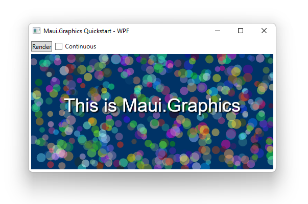

This page describes how to draw using Maui.Graphics from a WPF application.

> **⚠️ Warning:** The Maui.Graphics package is currently in preview and its API may change as the library matures.

<div class='text-center img-border'>



</div>

#### 1. Create a WPF Application

```sh
dotnet new wpf
```

#### 2. Add NuGet Packages

```sh
dotnet add package Microsoft.Maui.Graphics
dotnet add package Microsoft.Maui.Graphics.Skia
dotnet add package SkiaSharp.Views.WPF
```

#### 3. Add a SkiaSharp Element

```xml
<Window x:Class="QuickstartWpf.MainWindow"
        xmlns:local="clr-namespace:QuickstartWpf"
        xmlns:skia="clr-namespace:SkiaSharp.Views.WPF;assembly=SkiaSharp.Views.WPF">
    <Grid>
        <skia:SKElement PaintSurface="SKElement_PaintSurface"/>
    </Grid>
</Window>
```

#### 4. Draw Graphics

```cs
private void SKElement_PaintSurface(object sender, SkiaSharp.Views.Desktop.SKPaintSurfaceEventArgs e)
{
    ICanvas canvas = new SkiaCanvas() { Canvas = e.Surface.Canvas };

    canvas.FillColor = Colors.Navy;
    canvas.FillRectangle(0, 0, (float)SkElement1.ActualWidth, (float)SkElement1.ActualHeight);

    canvas.StrokeColor = Colors.White.WithAlpha(.5f);
    canvas.StrokeSize = 2;
    for (int i = 0; i < 100; i++)
    {
        float x = Random.Shared.Next((int)SkElement1.ActualWidth);
        float y = Random.Shared.Next((int)SkElement1.ActualHeight);
        float r = Random.Shared.Next(5, 50);
        canvas.DrawCircle(x, y, r);
    }
}
```

## Resources

* [Download the source code for this project](https://github.com/swharden/Csharp-Data-Visualization/tree/main/projects/maui-graphics)
* [https://maui.graphics](https://maui.graphics)