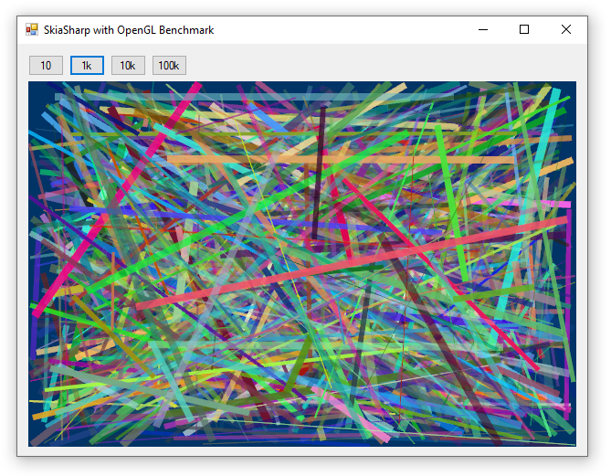

The [drawing with SkiaSharp](../skiasharp) page described how to use Skia to render graphics on a Bitmap and display them in a `PictureBox`. **In this project we will use the `skglControl` user control to create an OpenGL-accelerated surface for us to draw on.** OpenGL will offer an excellent performance enhancement, especially when creating large or full-screen animations.

<div align="center">



Drawing Library | 10 lines | 1k lines | 10k lines | 100k lines
---|---|---|---|---
System.Drawing | 0.614 ms | 28.350 ms | 278.477 ms | 2.834 sec
SkiaSharp | 12.777 ms | 97.011 ms | 352.343 ms | 3.493 sec
SkiaSharp + OpenGL | 2.973 ms | 6.588 ms | 40.765 ms | 422.217 ms

</div>

## Code

* You ***must*** target 32-bit or 64-bit, not "any CPU"
* Install the `SkiaSharp.Views.WindowsForms` NuGet package
* Drag a `SKGLControl` onto the form

### Render In the PaintSurface Event

The `SKGLControl` you created has a `PaintSurface` event that can be used for rendering. This event is especially useful because the SKSurface is passed in as an argument. 

```cs
private void skglControl1_PaintSurface(object sender, SkiaSharp.Views.Desktop.SKPaintGLSurfaceEventArgs e)
{
    e.Surface.Canvas.Clear(SKColor.Parse("#003366"));
    for (int i = 0; i < lineCount; i++)
    {
        var paint = new SKPaint
        {
            Color = new SKColor(
                red: (byte)rand.Next(255),
                green: (byte)rand.Next(255),
                blue: (byte)rand.Next(255),
                alpha: (byte)rand.Next(255)),
            StrokeWidth = rand.Next(1, 10),
            IsAntialias = true
        };
        e.Surface.Canvas.DrawLine(
            x0: rand.Next(skglControl1.Width),
            y0: rand.Next(skglControl1.Height),
            x1: rand.Next(skglControl1.Width),
            y1: rand.Next(skglControl1.Height),
            paint: paint);
    }
}
```

### Trigger a Render

Rendering only occurs when our control is re-painted, but painting doesn't happen continuously. To trigger renders we must indicate a new paint is required by calling the control's `invalidate` method. 

```cs
skglControl1.Invalidate();
```

### Render Continuously

To create animations you can call `Invalidate` using a Timer set to 1ms:

```cs
private void timer1_Tick(object sender, EventArgs e)
{
    skglControl1.Invalidate();
}
```

## Source Code

Source code for this project is on GitHub:
[SkiaSharpOpenGLBenchmark](https://github.com/swharden/Csharp-Data-Visualization/tree/master/dev/old/drawing/alternate/SkiaSharpOpenGLBenchmark)