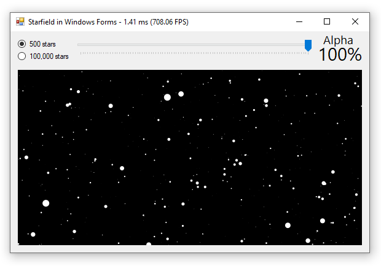
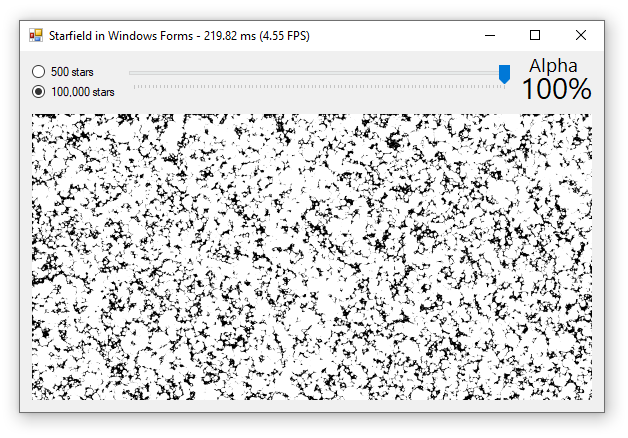

**This page investigates ways to benchmark your graphics model and rendering system** using Visual Studio's CPU profiling tools to identify bottlenecks and figure out which parts of your program you can refactor to improve performance.



> **💡 TIP:** Use the Form's `Title` to display benchmark information in the application's title bar while developing. This is an easy way to display flicker-free text without having to create new controls or modify your layout.

## Measure FPS with a Stopwatch

We can use a class-level Stopwatch to time how long it takes to draw a frame, then we can wrap our render sequence with a timer reset and measurement. 

```cs
Stopwatch stopwatch = new Stopwatch();
private void timer1_Tick(object sender, EventArgs e)
{
    stopwatch.Restart();
    field.Advance();
    /* drawing code */
    double elapsedSec = (double)stopwatch.ElapsedTicks / Stopwatch.Frequency;
    Text = $"Starfield in Windows Forms - {elapsedSec * 1000:0.00} ms ({1 / elapsedSec:0.00} FPS)";
}
```

Using this method we find that when the application is switched to use a starfield with 100 thousand stars there is an immediate drop in GUI responsiveness as the frame-rate drops below 5 FPS. 

500 Stars (~700 FPS) | 100,000 Stars (~4.5 FPS)
---|---
|

> **💡 TIP:** Use two timers to separately measure performance of the model advancement vs. the graphics rendering system.

## CPU Performance Analysis with Visual Studio


Using [Visual Studio's performance monitoring tools](https://docs.microsoft.com/en-us/visualstudio/profiling/quickstart-cpu-usage-managed) we can profile our CPU usage while this application runs to get a better idea of where the slowdown is coming from.


This reveals that the "hot path" (the single method taking the most CPU time) is the call to `System.Drawing.Graphics.FillEllipse()` at over 70% of total CPU time. In contrast our graphics model advancement method takes less than 1% of CPU time.

This is insightful because it indicates that optimizing our graphics renderer, and not our graphics model, is where we should focus our efforts to maximize performance. 

> **🤔 Think about it:** If your drawing calls are the rate-limiting factor, the best way to increase performance is to use a faster graphics library (like SkiaSharp and OpenGL). On the other hand, if your graphics model calls are the rate-limiting factor, the biggest performance increases will come from optimizing the calculations in your model.

## Improve Performance with a Premultiplied PixelFormat

A slight performance improvement can be realized by instantiating `Bitmap` objects which utilize the _premultiplied alpha_ pixel formats. 

This holds true with most graphics libraries, not just System.Drawing.

In benchmark tests drawing 10,000 random lines use of premultiplied pixel format increased render speed by about 10%.

```cs
var pixelFormat = System.Drawing.Imaging.PixelFormat.Format32bppPArgb;
var bmp = new Bitmap(width, height, pixelFormat);
```

> **💡 Deep dive:** Learn more about [straight vs. premultiplied alpha composition](https://en.wikipedia.org/wiki/Alpha_compositing#Straight_versus_premultiplied) theory on Wikipedia, and the application of [premultiplied alpha](https://microsoft.github.io/Win2D/html/PremultipliedAlpha.htm) in the .NET environment from Microsoft's website.

## Source Code

* GitHub: [Form1.cs](https://github.com/swharden/Csharp-Data-Visualization/blob/master/dev/old/drawing/starfield/Starfield.WinForms/Form1.cs)