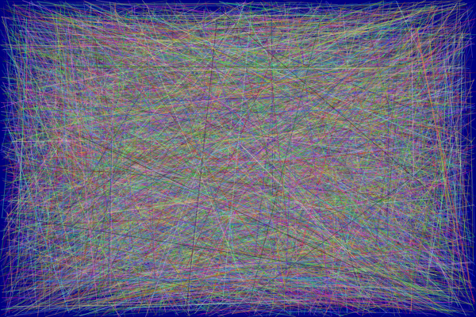
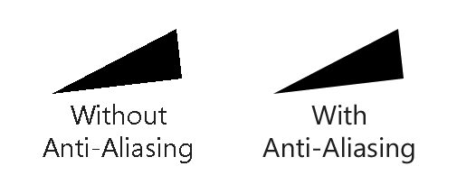

This example uses [System.Drawing](https://docs.microsoft.com/en-us/dotnet/api/system.drawing) in a Console Application to draw 10,000 random lines on a dark blue background and save the output as a PNG file. 

<div align="center">



</div>

In the past System.Drawing could only be used on Windows, but [System.Drawing.Common](https://www.nuget.org/packages/System.Drawing.Common/) (released in 2017) brings System.Drawing to .NET Core for use on any operating system.

### Code

This code creates a `Bitmap` in memory, creates a `Graphics` object for it, then use the `Graphics` methods for drawing. When run, this code block produces the image at the top of the page.

```cs
static void Main(string[] args)
{
    Random rand = new Random();
    using (var bmp = new Bitmap(600, 400))
    using (var gfx = Graphics.FromImage(bmp))
    using (var pen = new Pen(Color.White))
    {
        gfx.SmoothingMode = System.Drawing.Drawing2D.SmoothingMode.AntiAlias;
        gfx.Clear(Color.Navy);
        for (int i = 0; i < 10_000; i++)
        {
            pen.Color = Color.FromArgb(rand.Next());
            var pt1 = new Point(rand.Next(bmp.Width), rand.Next(bmp.Height));
            var pt2 = new Point(rand.Next(bmp.Width), rand.Next(bmp.Height));
            gfx.DrawLine(pen, pt1, pt2);
        }
        bmp.Save("drawing-quickstart-console.png");
    }
}
```

### Respect `IDisposable`

Many System.Drawing objects inherit from `IDisposable` and it is ***critical*** that they are disposed of properly to avoid memory issues. This means calling `Dispose()` after you're done using an object, or better yet throwing its instantiation inside a `using` statement.

> 💡 **Deep Dive:** Read Microsoft's documentation about [using objects that implement IDisposable](https://docs.microsoft.com/en-us/dotnet/standard/garbage-collection/using-objects)

Take care to properly dispose of these common System.Drawing objects:
* [`System.Drawing.Image`](https://docs.microsoft.com/en-us/dotnet/api/system.drawing.image)
* [`System.Drawing.Bitmap`](https://docs.microsoft.com/en-us/dotnet/api/system.drawing.bitmap)
* [`System.Drawing.Graphics`](https://docs.microsoft.com/en-us/dotnet/api/system.drawing.graphics)
* [`System.Drawing.Pen`](https://docs.microsoft.com/en-us/dotnet/api/system.drawing.pen)
* [`System.Drawing.Brush`](https://docs.microsoft.com/en-us/dotnet/api/system.drawing.brush)
* [`System.Drawing.Font`](https://docs.microsoft.com/en-us/dotnet/api/system.drawing.font)
* [`System.Drawing.FontFamily`](https://docs.microsoft.com/en-us/dotnet/api/system.drawing.fontfamily)
* [`System.Drawing.StringFormat`](https://docs.microsoft.com/en-us/dotnet/api/system.drawing.stringformat)


### Drawing Anti-Aliased Graphics and Text
By default graphics will not be anti-aliased. Anti-aliasing is slower (especially for long lines), but looks superior when drawing angled lines and edges. 

<div align="center">



</div>

Anti-aliasing is controlled differently for graphics and text:

```cs
// set anti-aliasing mode for graphics
gfx.SmoothingMode = System.Drawing.Drawing2D.SmoothingMode.AntiAlias;
gfx.SmoothingMode = System.Drawing.Drawing2D.SmoothingMode.HighSpeed;

// set anti-aliasing mode for text
gfx.TextRenderingHint = System.Drawing.Text.TextRenderingHint.AntiAlias;
gfx.TextRenderingHint = System.Drawing.Text.TextRenderingHint.SingleBitPerPixel;
```

## Download Source Code

_This code supports .NET Core and .NET Framework_

* View on GitHub: [Program.cs](https://github.com/swharden/Csharp-Data-Visualization/blob/master/dev/old/drawing/quickstart-console/Program.cs)
* Download this project: [quickstart-console.zip](files/quickstart-console.zip)